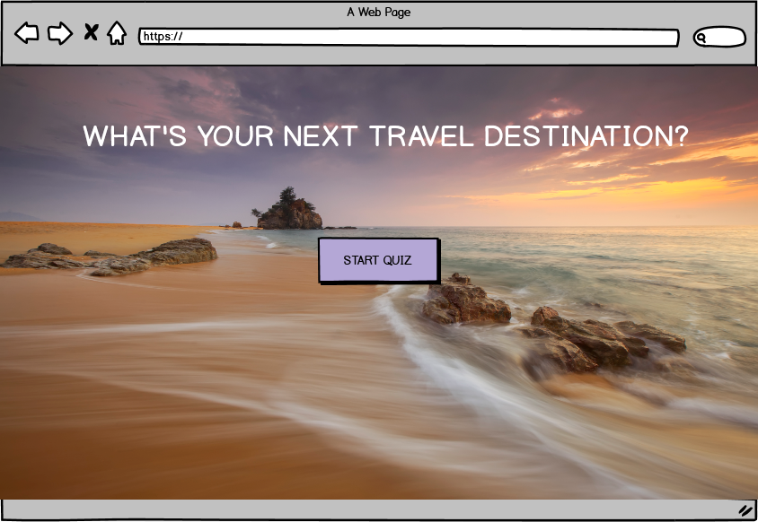

# Travel Quiz</h1>

This site is a fully interative and responsive travel quiz, to help the user
decide on where is best to travel dependant on their specific wants and needs 
at that time. Once answered a comprehensive set of questions, they will be given 
a tailored recommendation for a destination, and more information as of where this place is
on Google maps. I am also looking to include links to a flight and accomodation
comparison sites.

 

## Why is this project unique?

There are many accomodation and flight comparison sites out there, but you need to know
the destination prior to researching. There are also quizzes out there to help you make a 
decision on your destination. As far as I can see there is not a site to combine all the 
neccessary steps to travel, from researching the best place for you, to booking your trip.
As you can see in the `Releases` section, the amount and specificity of the questions will 
increase and therefore the quiz will be unique within itself.

## UX

### Project Goals

To provide an efficient way to help a user find there ideal travel destination
without having to to lots of research into their requirements. Also to provide
more information on that destination to aid with the follow up research needed.

### User Goals

To understand where to go away on their next travel exercution, somewhere that is
completed suited to their preferences, saving them lots of time. Also wanting clear paths
on where to go next so they can plan their trip

### User Stories</h3>
#### As a user...</h4>
<ol>
<li>I want simple, concise questions so I can complete the quiz quickly.</li>
<li>I don't want too many answer options so I don't get overwhelmed by the choice and can't make a decision.</li>
<li>I want to recieve confirmation I have answered and moved onto the next question.</li>
<li>I want a simple design, so not to distract from the questions in the quiz.</li>
<li>I want information on my chosen country so I can follow up from the quiz, there is a reason I decided to take the 
quiz and therefore expect a stepping stone into actioning my trip.</li>
</ol>

## Design choices

I have chosen a minilistic design, it is a simple front-end concept, therefore I wanted to keep all the attention on the quiz, 
allowing the user to complete it with efficiency. The goal is to allow the user to relax and become excited for a rejuvinating get away. 
I have kept all corners rounded to create a 'soft' affect, similarily I have added some transparency to containers holding content.

### Background Image
<ul><li>This background image has a calming yet exciting feel due to the colour schemes. I chose purple, orange and pinks. 
Orange and pink are exciting colours to grab attention, whilst purple is calming and trustworthy. I also chose this background image
due to it's composition and perspective. The user is pulled into the scene and is now in the right mindset for the quiz!</li></ul>

### Font
<ul><li>The headings and nav bar headings are white in colour to stand out on top of a multicoloured background. 
The questions are a dark blue to match the blue tones in the background and stand out in the question container.</li>
<li>The font I chose was Montserrat. This is a simple but professional font, keeping in style with the minimilistic tone of the site.</li>
<li>Font sizes are large and responsive throughout. There is a varied demographic that would complete this quiz, we need to make sure
everyone is able to read the questions and answers with ease.
</li>
</ul>

### Buttons
<ul><li>The buttons are large on all devises, this is to ease of use. They are also consistent with the colour theme and compliment
the colours on the background photo. The buttons change to a darker purple when the users cursor hovers over them, which turns into a pointer.
The user will know to click and move onto the next step.</li></ul>

## Wireframes
All Wireframes were created using [Balsamiq Wireframes](https://balsamiq.com/)

## Features</h2>

## Releases
### Release 1
### Release 2
### Release 3

## Technologies Used
<ul>
<li>HTML5</li>
<li>CSS3</li>
<li>JavaScript</li>
<li>JQuery</li>
<li>BootStrap4</li>
<li>GitHub</li>
<li>GitPod</li>
<li>Google Fonts</li>
<li>Font Awesome</li>
<li>Balsamiq Wireframes</li>
</ul>

<h2>Testing</h2>

<h2>Deployment</h2>

<h2>Credits</h2>

<h3>Content</h3>

All content written in this project was written by the developer.

<h3>Media (Images)</h3>
<ul><li>I sourced my background photo from [Dreamstime](https://www.dreamstime.com/) All copyrights belong to them.</li>
<li>I sourced 4 icons on my 'About' page from [Font Awesome](https://fontawesome.com/icons?d=gallery&q=home)</li>
</ul>

<h3>Code</h3>
<ul>
I got inspiration for the basic structure of my quiz from [Site Point](https://www.sitepoint.com/simple-javascript-quiz/), I then changed
and edited the JavaScript to fit my purpose.
<li>Nav bar from [Codeply & Bootstrap 4](https://www.codeply.com/go/QAXbNGbWPA/bootstrap-4-navbar-transparent) </li>
<li>Box shadow codes were generated at [CSS matic | box-shadow](https://www.cssmatic.com/box-shadow)</li>
</ul>

<h3>Achknowledgments</h3>
<ul>
<li>A special thanks to my mentor Spencer for helping me throughout.</li>
<li>Also to the student care team at The Code Institute for helping troubleshoot my code at those head scratching
moments!</li>
</ul>